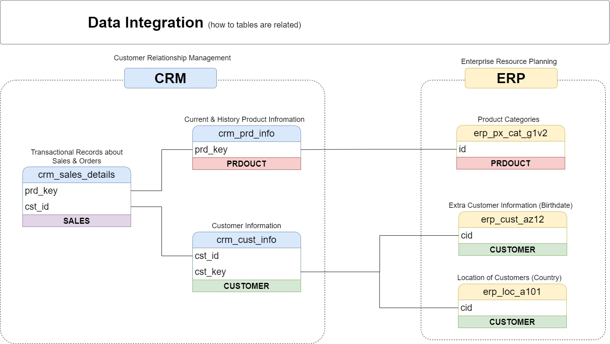
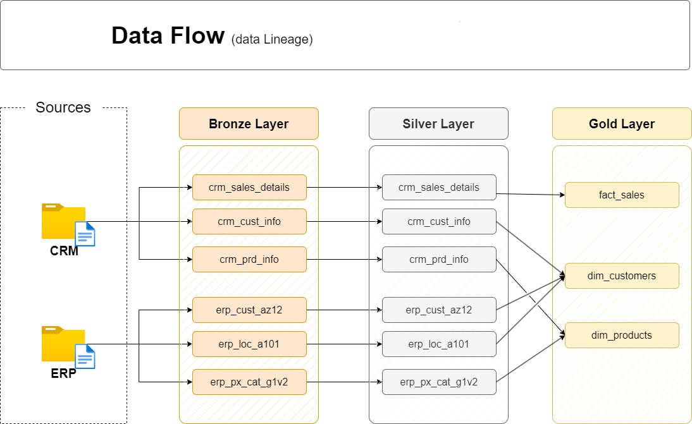
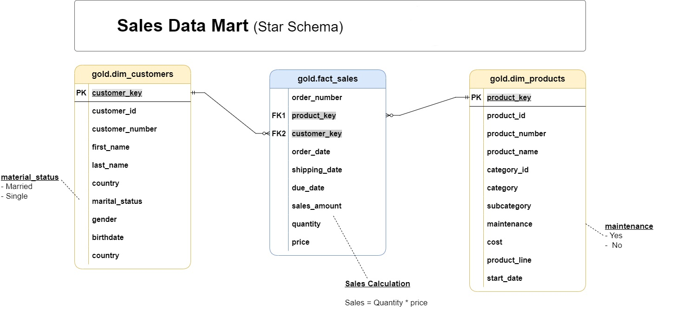

<h1 align="center">Full-Cycle End-to-End Data Engineering & Analytics</h1>

---

# Phase I: Data Warehouse Engineering

## A.🏗️ Data Architecture Design & Strategy
### Data Management Approach
- A **Data Warehouse (DWH)**–centric approach is adopted
- Optimized for:
  - Structured reporting
  - Complex analytical queries
  - Long-term historical analysis
  - Strong data governance
### Layers Approach
- A **Medallion Architecture**– approach is adopted
- This multi-layer approach provides a clear roadmap for data refinement
- **🥉Bronze Layer (Raw)**
  - Ingests data in its original format
  - Preserves full traceability to source systems
  - Serves as the immutable system of record

- **🥈Silver Layer (Transformed)**
  - Performs data transformation, cleansing
  - Integrates multiple data sources
  - Prepares the data for future analysis, ensuring it is cleaned and consistent

Prepares the data for analytics and downstream processing, ensuring it is structured, consistent, and ready for use

- **🥇Gold Layer (Curated)**
  - Business-ready, analytics-optimized datasets
  - Designed for dashboards, BI tools, and reporting
  - Implements dimensional models (facts and dimensions)

#### Separation of Concerns (SoC)
Each layer is logically and physically isolated to ensure:
- Clear ownership of responsibilities
- No duplicated transformations
- Reduced error propagation
- Simplified maintenance and scalability

  

---

## B. Naming Conventions & Environment Setup

Consistency across environments ensures readability, maintainability, and self-documentation.

## Naming Standards
### General
- All database objects follow **snake_case**
### Loading & Object Naming Pattern
- Loading Methods: All data movement is handled via Stored Procedures following the pattern:
  - `<schema_name>.load_schema_name`
  - Example:
    - `bronze.load_bronze`
### **Surrogate Keys**  
- All primary keys in dimension tables must use the suffix `_key`.
- **`<table_name>_key`**  
  - `<table_name>`: Refers to the name of the table or entity the key belongs to.  
  - `_key`: A suffix indicating that this column is a surrogate key.  
  - Example: `customer_key` → Surrogate key in the `dim_customers` table.

### Layer-Specific Naming Conventions

#### Bronze Layer
- Format:
  - `<schema_name>.sourcename_table_name`
  - Example:
    - `bronze.crm_cust_info`

#### Silver Layer
- Mirrors Bronze naming conventions
- Technical and metadata columns prefixed with `dwh_` following by the column name
- Exmple
  - `dwh_customer_age`

#### Gold Layer
- Organized by analytical purpose:
  - **Dimensions**: `dim_table_name`
  - **Facts**: `f_table_name`
- Examples:
  - `dim_prodcuts`
  - `f_sales`

## Database & Schema Setup
Creating the DataWarehouse database along with the bronze, silver, and gold schemas.
It ensures a clean setup for the ETL process by dropping any existing database and recreating it with the necessary structure for raw, transformed, and analytics-ready data.
- 
 See <a href="scripts/1.Implement/init_database.sql">init_database.sql</a> for full implementation details.

---

## C. Layer Construction & ETL Implementation

The data pipeline is implemented in three clearly defined stages.

  

### 1-Bronze Layer Implementation

The **Bronze Layer** serves as the **raw ingestion layer** where data is captured in its original format with minimal transformation. The implementation follows a structured approach to ensure **data traceability, consistency, and quality

#### Source Data Analysis
Before ingestion, we perform a detailed **analysis of source systems** to understand:
- Business domains and context
- Data structure and description
- Available extract methods
- Columns Data Types

This step ensures we choose the **most appropriate extraction and loading strategy**.

#### Create Bronze Tables in Bronze Schema
Tables are created in the Bronze schema with suitable column names and data types determined by analyzing the source data. This ensures the schema accurately reflects the structure and type of the ingested data, providing a reliable foundation for further ETL processing.

- 
 See <a href="scripts/2.bronze/1.Building/ddl_bronze.sql">ddl_bronze.sql</a>

#### Extraction & Loading Strategy
For the Bronze Layer, we adopt the following methods:

- **Extraction Method: Full type with Pull Method and File Parsing technique**

  Data is extracted using a **Full approach**, meaning all available records from the source system are retrieved during each extraction run to ensure the target has a complete dataset. The extraction uses a **pull method**, where the ETL system actively requests data from the source ensuring data is fetched on-demand according to schedule or trigger. Extracted data is then processed through **file parsing** techniques , Files are read, validated, and transformed into a structured format suitable for loading into the target system
  
- **Load Method: Batch Processing type with Full load method (Truncate & Insert) and SCD Type 1 Overwrite**  

  Data is loaded in **batches** to optimize performance and resource usage. Each load is a **full load**, where the target tables are **truncated before inserting new records**, ensuring no residual duplicates from previous runs. For historical management, an **SCD Type 1 approach** is used, meaning previous records are overwritten to keep the tables up-to-date with the latest snapshot
  
- **Performance Optimization:**

  Bulk inserts and TABLOCK hints are applied where supported to accelerate performance and handle large volumes efficiently.
  
#### Data Validation
After ingestion, we perform **data quality checks** to ensure:

- Correct column alignment (no shifted data)  
- All required fields are present and properly formatted  
- Consistency and completeness across records  

The **data insertion logic for populating Bronze Layer tables** uses stored procedures to ensure consistent, efficient, and reusable full data loads.
- 
 See <a href="scripts/2.bronze/2.Loading/proc_load_bronze.sql">proc_load_bronze.sql</a>

### 2-Silver Layer Implementation
The tables are initially created to mirror the bronze layer, after which transformations are applied to evaluate and validate the required changes.
- 
 See <a href="scripts/3.silver/1.Building/ddl_silver.sql">ddl_silver.sql</a>

**Prior to**🧬the transformation phase, cross-source integration is designed to define how tables will relate to one another; however, no joins or integrations are applied at this stage.

 #### Transformation ⚙️
  - Introduction of technical metadata
  - Data Normalization and standardization
  - Data Enrichment
  - Drived Columns
  - **Data Cleansing:**
      - Remove Duplicates
      - Handling Unwanted Spaces
      - Handling Invalid Vlaues
      - Handling Missing Values
      - Outlier Detection
      - Data Type Casting
      - Data Filtering
    

  
    
  
  
    
  

The data types of certain columns are **modified** as required upon completion of all processing stages, which necessitates the **recreation** of some tables.

The **data insertion logic for populating Silver Layer tables** uses stored procedures to ensure consistent, efficient, and reusable full data loads.
- 
 See <a href="scripts/3.silver/2.Cleaning/proc_load_silver.sql">proc_load_silver.sql</a>

#### Data Quality Checks
* Data quality validations are performed after the Silver layer is created
* Checks all applied modifications to ensure they were implemented correctly.
* Quality check scripts can be found here:
  - 
 See <a href="scripts/3.silver/3.Testing/quality_checks_silver.sql">quality_checks_silver.sql</a>

### 3-Gold Layer Implementation
#### Overview
* The Gold layer represents the final, business-ready layer of the data warehouse, designed for analytics and reporting
* It applies a Star Schema model to deliver clean, consistent, and business-aligned data
* This layer abstracts technical complexity and exposes optimized views for downstream consumption
* The end-to-end data flow is completed at this stage, resulting in a finalized analytical data mart

  
    
  
  
    
  

#### Key Characteristics
* Curated analytical views sourced from validated Silver-layer data
* Columns are rearranged into logical groups to improve readability and analytical usability
* Cross-source integration is finalized with clear ownership of attributes
* Duplicate and overlapping attributes are examined and resolved by prioritizing master table definitions
* Final business rules, cleansing, and standardization are applied to ensure consistency

#### Creation
* The Gold layer is created using SQL view definitions
* All transformations and business logic are implemented during view creation
* View creation scripts can be found here:
  - 
 See <a href="scripts/4.gold/1.Prepairing/1.Building/ddl_gold.sql">ddl_gold.sql</a>

#### Data Quality Checks
* Data quality validations are performed after the Gold layer is created
* Checks include referential integrity, duplicate detection, and model consistency
* Quality check scripts can be found here:
  - 
 See <a href="scripts/4.gold/1.Prepairing/2.Testing/quality_checks_gold.sql">quality_checks_gold.sql</a>

## Usage
* Designed for direct consumption by BI tools and analytical queries
* Optimized for dashboards, KPIs, and advanced analytics

### Data Catalog for Gold Layer

#### Overview
The Gold Layer is the business-level data representation, structured to support analytical and reporting use cases. It consists of **dimension tables** and **fact tables** for specific business metrics.

---
#### 1. **🔹gold.dim_customers**
- **Purpose:** Stores customer details enriched with demographic and geographic data.
- **Columns:**

| Column Name      | Data Type     | Description                                                                                   |
|------------------|---------------|-----------------------------------------------------------------------------------------------|
| customer_key     | INT           | Surrogate key uniquely identifying each customer record in the dimension table.               |
| customer_id      | INT           | Unique numerical identifier assigned to each customer.                                        |
| customer_number  | NVARCHAR(50)  | Alphanumeric identifier representing the customer, used for tracking and referencing.         |
| first_name       | NVARCHAR(50)  | The customer's first name, as recorded in the system.                                         |
| last_name        | NVARCHAR(50)  | The customer's last name or family name.                                                     |
| country          | NVARCHAR(50)  | The country of residence for the customer (e.g., 'Australia').                               |
| marital_status   | NVARCHAR(50)  | The marital status of the customer (e.g., 'Married', 'Single').                              |
| gender           | NVARCHAR(50)  | The gender of the customer (e.g., 'Male', 'Female', 'n/a').                                  |
| birthdate        | DATE          | The date of birth of the customer, formatted as YYYY-MM-DD (e.g., 1971-10-06).               |
| create_date      | DATE          | The date and time when the customer record was created in the system|

---

#### 2. **🔹gold.dim_products**
- **Purpose:** Provides information about the products and their attributes.
- **Columns:**

| Column Name         | Data Type     | Description                                                                                   |
|---------------------|---------------|-----------------------------------------------------------------------------------------------|
| product_key         | INT           | Surrogate key uniquely identifying each product record in the product dimension table.         |
| product_id          | INT           | A unique identifier assigned to the product for internal tracking and referencing.            |
| product_number      | NVARCHAR(50)  | A structured alphanumeric code representing the product, often used for categorization or inventory. |
| product_name        | NVARCHAR(50)  | Descriptive name of the product, including key details such as type, color, and size.         |
| category_id         | NVARCHAR(50)  | A unique identifier for the product's category, linking to its high-level classification.     |
| category            | NVARCHAR(50)  | The broader classification of the product (e.g., Bikes, Components) to group related items.  |
| subcategory         | NVARCHAR(50)  | A more detailed classification of the product within the category, such as product type.      |
| maintenance_required| NVARCHAR(50)  | Indicates whether the product requires maintenance (e.g., 'Yes', 'No').                       |
| cost                | INT           | The cost or base price of the product, measured in monetary units.                            |
| product_line        | NVARCHAR(50)  | The specific product line or series to which the product belongs (e.g., Road, Mountain).      |
| start_date          | DATE          | The date when the product became available for sale or use, stored in|

---

#### 3. **🔹gold.fact_sales**
- **Purpose:** Stores transactional sales data for analytical purposes.
- **Columns:**

| Column Name     | Data Type     | Description                                                                                   |
|-----------------|---------------|-----------------------------------------------------------------------------------------------|
| order_number    | NVARCHAR(50)  | A unique alphanumeric identifier for each sales order (e.g., 'SO54496').                      |
| product_key     | INT           | Surrogate key linking the order to the product dimension table.                               |
| customer_key    | INT           | Surrogate key linking the order to the customer dimension table.                              |
| order_date      | DATE          | The date when the order was placed.                                                           |
| shipping_date   | DATE          | The date when the order was shipped to the customer.                                          |
| due_date        | DATE          | The date when the order payment was due.                                                      |
| sales_amount    | INT           | The total monetary value of the sale for the line item, in whole currency units (e.g., 25).   |
| quantity        | INT           | The number of units of the product ordered for the line item (e.g., 1).                       |
| price           | INT           | The price per unit of the product for the line item, in whole currency units (e.g., 25).      |
---

# Phase II: Exploratory Data Analysis (EDA) And Advanced Data Analytics

## Comprehensive Data Analytics Process📉
The project transitions from engineering to insights through a two-phase analytical roadmap.

### **Exploratory Data Analysis (EDA)**
1.  **Database Exploration:** Assessing the overall structure and volume.
2.  **Dimensions Exploration:** Validating attribute distributions.
3.  **Date Exploration:** Analyzing business history.
4.  **Measures Exploration:** Identifying "Big Numbers" like total revenue.
5.  **Magnitude:** Visualizing volume and scale.
6.  **Ranking:** Identifying Top N vs. Bottom N performers.

### **Advanced Analytics**
7.  **Change-Over-Time:** Detailed trend analysis and growth tracking.
8.  **Cumulative Analysis:** Running totals and Year-to-Date (YTD) performance.
9.  **Performance Analysis:** Benchmarking actual performance against business targets.
10. **Part-to-Whole (Proportional):** Analyzing category contributions to the total business.
11. **Data Segmentation:** Clustering data for targeted marketing and operational focus.

### **🗄️SQL Reporting Layer**
Transforming storage data into a high-level analytical suite via SQL layers.

High-performance reporting views serving as the "Single Version of Truth.

12.  **Product Analytical Report (`gold.report_products`)**
    * **Core Consolidation:** Merges CRM product details with ERP categories/costs.
    * **Dynamic Segmentation:** Automatically categorizes products into High, Mid, or Low Performers.
    * **KPI Engineering:** Tracks Market Reach, Sales Volume, Lifespan Analysis, Recency, AOR, and Pricing Accuracy.

13.  **Customer Analytical Report (`gold.report_customers`)**
    * **Consolidation:** Integrates CRM profiles with ERP geographic and demographic data.
    * **Intelligence:** Embedded logic for Age Grouping and Customer Lifetime Value (CLV).

# Phase III: Data Visualization

## **Tableau Dashboard Development**
Professional design lifecycle followed:

**Analyze Requirements → Build Data Source → Build Charts → Build Dashboards.**

* **💰 Sales Dashboard:** Financial performance, YoY comparisons, Max/Min indicators, and Weekly Trends.
* **👥 Customer Dashboard:** Behavioral segmentation, Executive KPIs, and VIP Customer Analysis.

###  Live Interactive Dashboard 📊
🔗 [View on Tableau Public](https://public.tableau.com/views/SalesCustomersProductsDashboard/SalesDashboard?:language=en-US&:display_count=n&:origin=viz_share_link) 📄 [View PDF Dashboard](Visualization/Sales%20&%20Customers%20&%20Products%20Dashboard.pdf)
---

# 🛠️ Tech Stack & Technical Proficiencies

### **Database Engineering (SQL Server)**
* **Architecture:** Medallion Framework (Bronze, Silver, Gold).
* **Object Development:** Stored Procedures, SQL Views, DDL/DML.
* **Modeling:** Star Schema, SCD Type 1, Batch Processing.
* **Cleaning:** Regex parsing, deduplication, and outlier handling.

### **Business Intelligence & Visualization (Tableau)**
* **Lifecycle:** Requirements → Data Optimization → Chart Engineering → UI Layout.
* **Analytics:** YoY Growth, Parameter-Driven Logic, Reference Lines.
* **UI/UX:** Nested Containers, Customized Tooltips, Navigation Buttons.

### **Methodology**
* **Lifecycle:** End-to-End ETL/ELT.
* **Strategy:** User Story Mapping.
* **Documentation:** Data Cataloging and Logic Mapping.
---

